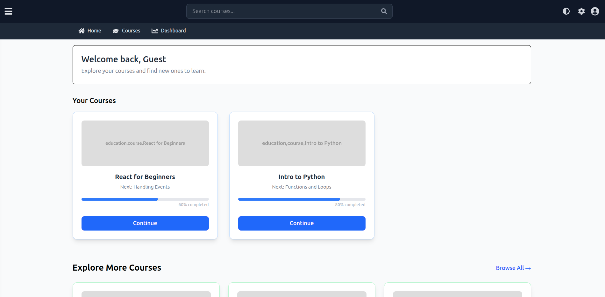
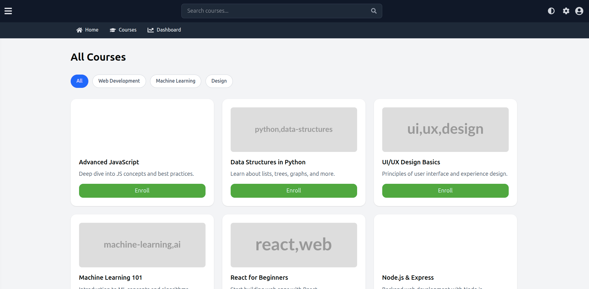
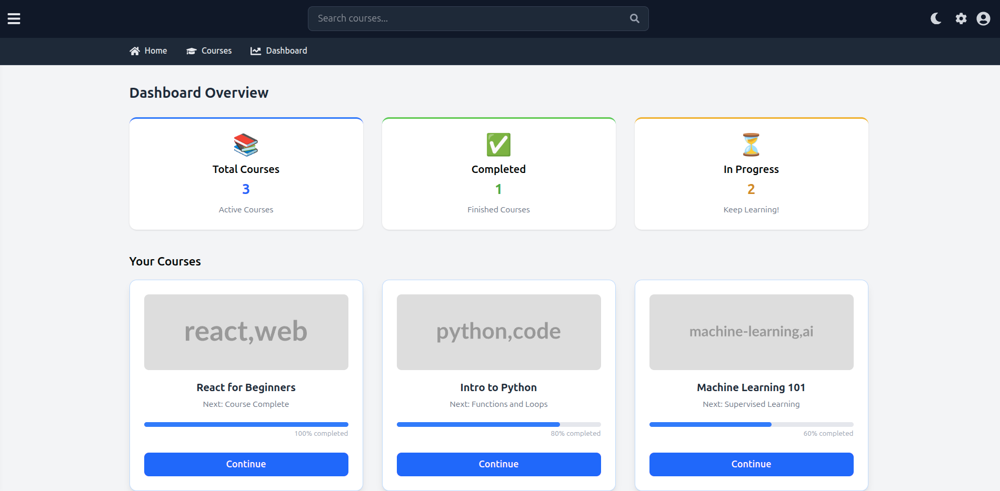

# Learning Management System (LMS) - Frontend

This is the frontend of the Learning Management System application, built with React.

## Technologies Used

- React.js
- Vite
- Tailwind CSS
- Axios
- React Router DOM
- Redux Toolkit

## Setup Instructions

To set up the frontend, follow these steps:

### 1. Clone the repository

```bash
git clone <repository_url>
cd LMS
```

### 2. Frontend Setup

Navigate to the `Frontend` directory and install dependencies.

```bash
cd Frontend
npm install
```

### 3. Running the Application

#### Start the Frontend Development Server

From the `Frontend` directory:

```bash
npm run dev
```

The frontend application will typically be available at `http://localhost:5173` (or another port if 5173 is in use).

## Project Structure

```
LMS/
└── Frontend/
    ├── src/
    │   ├── assets/
    │   ├── components/
    │   ├── hooks/
    │   ├── pages/
    │   ├── slices/
    │   └── store/
    └── package.json
```

## Screenshots



